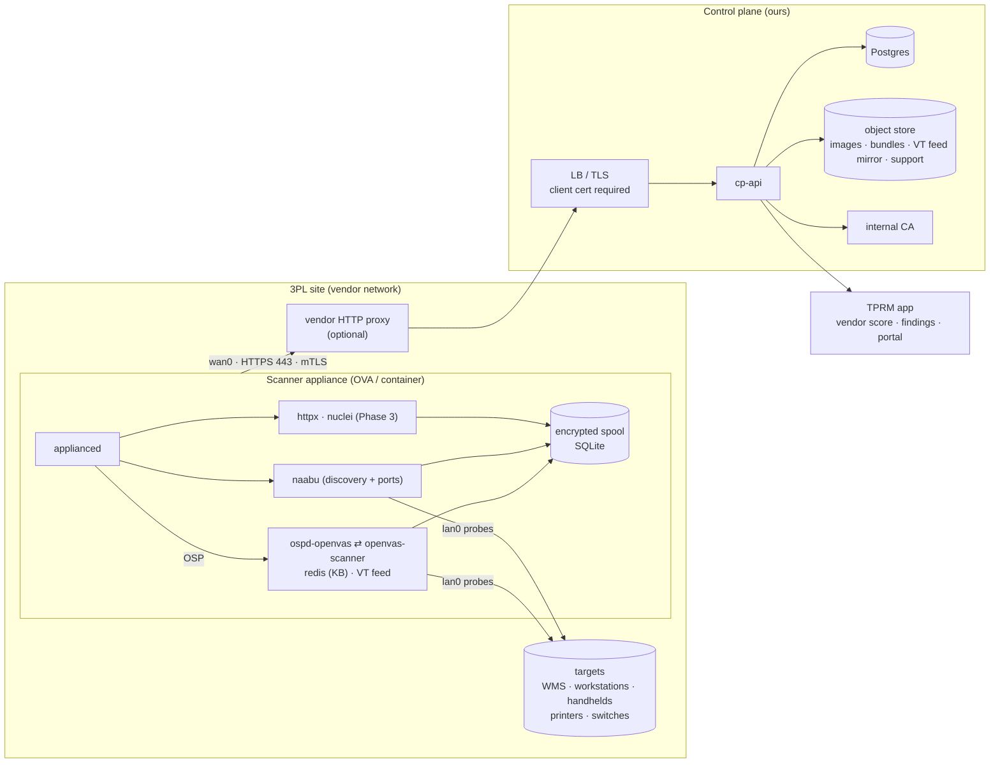
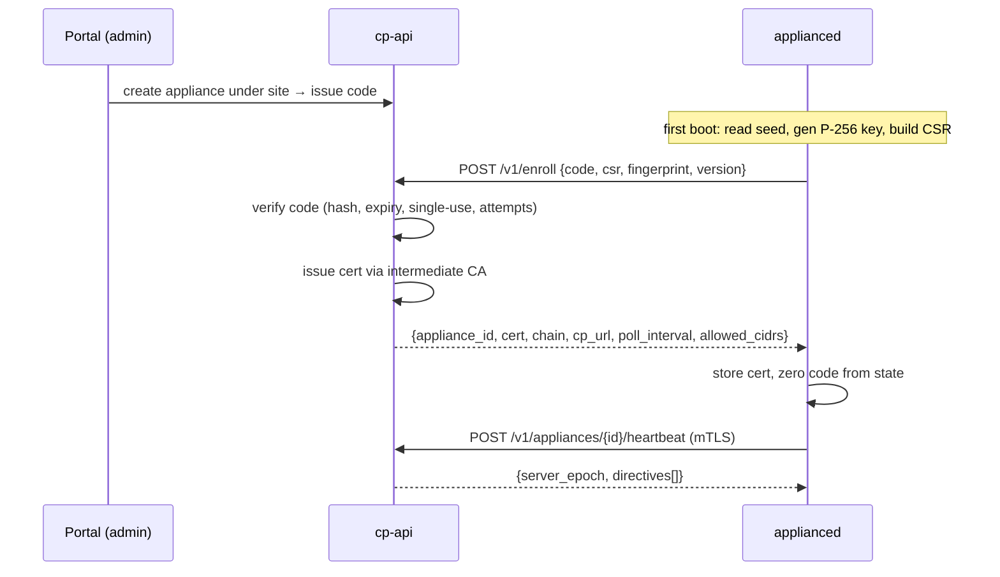
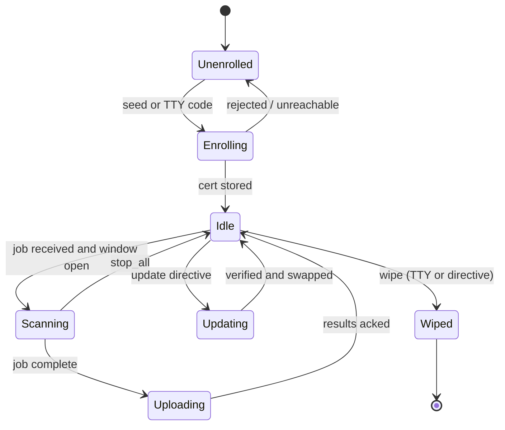
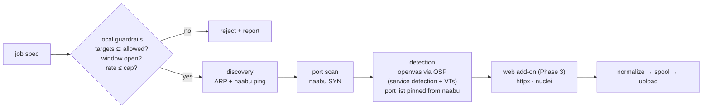

# Scanner Appliance — Implementation Plan

**Vendor-run, outbound-only, self-contained network scanner with its own control plane.**
Companion to the Wazuh-agent track of the in-house TPRM platform. The appliance covers what a host agent cannot: handhelds, printers, network gear, and any host a 3PL won't install software on.

> Status: draft v1.1 · 2026-09-26
> v1.1 changes: openvas (Greenbone scan engine) is the v1 detection core, embedded as scanner-only and driven over OSP; nuclei/httpx move to Phase 3 as the web add-on; standalone CPE→NVD matcher dropped; appliance minimum raised to 8 GB RAM / 60 GB disk; VT feed shipped in-image and delta-updated via bundle; Community Feed licensing confirmed as ODbL.

---

## Contents

1. [Goals and non-goals](#1-goals-and-non-goals)
2. [Architecture](#2-architecture)
3. [Component inventory](#3-component-inventory)
4. [Image build](#4-image-build)
5. [Personalization and seed resolution](#5-personalization-and-seed-resolution)
6. [Console (TTY menu)](#6-console-tty-menu)
7. [Enrollment, identity, mTLS](#7-enrollment-identity-mtls)
8. [Heartbeat and directives](#8-heartbeat-and-directives)
9. [Daemon internals](#9-daemon-internals)
10. [Scan engine](#10-scan-engine)
11. [Job spec and guardrails](#11-job-spec-and-guardrails)
12. [Results model and correlation](#12-results-model-and-correlation)
13. [Signature bundle pipeline](#13-signature-bundle-pipeline)
14. [Updates](#14-updates)
15. [Split-network mode](#15-split-network-mode)
16. [Security model](#16-security-model)
17. [Control plane](#17-control-plane)
18. [CI/CD and testing](#18-cicd-and-testing)
19. [Vendor onboarding](#19-vendor-onboarding)
20. [Phasing](#20-phasing)
21. [Licensing](#21-licensing)
22. [Risks and known gaps](#22-risks-and-known-gaps)
23. [Open decisions](#23-open-decisions)

---

## 1. Goals and non-goals

### Goals

| #   | Goal                                                          | Measure                                                             |
| --- | ------------------------------------------------------------- | ------------------------------------------------------------------- |
| G1  | Vendor deploys an image, enters one code, appliance is online | < 5 min from boot to `online` in portal                             |
| G2  | Zero inbound network exposure on the vendor's network         | No listening sockets; nftables input drop                           |
| G3  | Single egress requirement                                     | One FQDN, TCP 443, proxy-compatible                                 |
| G4  | Scans stay inside vendor-attested scope                       | Enforced both server-side and on-appliance                          |
| G5  | Results land in the same TPRM model as agent data             | Shared Postgres schema, correlated by host                          |
| G6  | Appliance is safe to lose                                     | No stored credentials, encrypted spool, revocable cert, remote wipe |
| G7  | Reproducible, signed images                                   | CI-built OVA / VHDX / qcow2 / container with signatures + SBOM      |
| G8  | Detection breadth comparable to a Qualys scanner appliance    | Full Greenbone VT feed available on every appliance                 |

### Non-goals

- Authenticated (credentialed) scanning of vendor hosts — that is the agent's job. This is also why notus (Greenbone's package-based local checks) is not embedded.
- Patch management or remediation actions on vendor systems.
- Web application scanning beyond nuclei's HTTP templates (Phase 3).
- Scanning anything outside the enrolled site's allowed ranges, including the public internet.
- Log collection or SIEM functions.
- Running Greenbone's management stack (gvmd, gsad) — the control plane is the manager.

---

## 2. Architecture



**Traffic rules**

| Direction                      | What                                                                                     | Port               |
| ------------------------------ | ---------------------------------------------------------------------------------------- | ------------------ |
| Appliance → control plane      | enroll, heartbeat, job poll, results, bundle/update download, support bundle, apt mirror | 443 only, one FQDN |
| Appliance → vendor LAN         | scan probes, scoped to allowed CIDRs                                                     | as scanned         |
| Anything → appliance           | nothing                                                                                  | —                  |
| Control plane → Greenbone feed | rsync mirror of the Community Feed (port 873, from our side only)                        | —                  |

---

## 3. Component inventory

| Component                    | Language / tech                                                                       | Lives in                   | Owner                  |
| ---------------------------- | ------------------------------------------------------------------------------------- | -------------------------- | ---------------------- |
| `applianced` daemon          | Go, static, `CGO_ENABLED=0`                                                           | image                      | us                     |
| TTY console                  | Go (subcommand of `applianced`)                                                       | image, tty1                | us                     |
| OSP client                   | Go, minimal XML-over-Unix-socket client                                               | inside `applianced`        | us                     |
| Detection engine             | `openvas-scanner` + `ospd-openvas` + redis, pinned Greenbone release tags built in CI | image                      | Greenbone (GPL)        |
| VT feed                      | Greenbone Community Feed (NASL VTs), mirrored by the control plane                    | image + bundle             | Greenbone (ODbL)       |
| Discovery / port scan        | naabu                                                                                 | image                      | ProjectDiscovery (MIT) |
| Web add-on (Phase 3)         | httpx, nuclei + templates                                                             | image                      | ProjectDiscovery (MIT) |
| Base image                   | Debian 12 minimal                                                                     | image                      | us (Packer)            |
| `cp-api`                     | Go + Postgres                                                                         | control plane              | us                     |
| Internal CA                  | step-ca or Go `crypto/x509` issuer                                                    | control plane              | us                     |
| Bundle builder + feed mirror | CI job → signed, content-addressed bundle                                             | control plane object store | us                     |
| Portal integration           | existing TPRM app                                                                     | control plane              | us                     |

Repo layout:

```
appliance/
├── packer/
│   ├── base.pkr.hcl              # qemu builder: Debian netinst + preseed → qcow2
│   ├── http/preseed.cfg
│   ├── scripts/{harden.sh, install-daemon.sh, install-openvas.sh, seed-feed.sh, cleanup.sh}
│   └── ovf/descriptor.ovf.tmpl   # OVF with ProductSection properties
├── docker/Dockerfile
├── daemon/                       # cmd/applianced, internal/{seed,enroll,heartbeat,tty,netcfg,spool,jobs,engine,osp}
├── controlplane/                 # cmd/cp-api, migrations/, internal/{ca,enroll,heartbeat,jobs,results,bundles,feedmirror}
├── bundle/                       # bundle builder: VT feed delta, scan configs, port lists, (nuclei templates)
└── ci/                           # build, sign, smoke-test
```

---

## 4. Image build

### 4.1 One source, three targets

Build a qcow2 with Packer's `qemu` builder (CI runner needs `/dev/kvm`), then convert. No VMware host in CI.

| Target                               | Conversion                                                                                                                 | Notes                                     |
| ------------------------------------ | -------------------------------------------------------------------------------------------------------------------------- | ----------------------------------------- |
| OVA (VMware, primary for warehouses) | `qemu-img convert -O vmdk -o subformat=streamOptimized` → OVF descriptor + `.mf` SHA256 manifest → `tar` (OVF entry first) | validate with `ovftool`                   |
| VHDX (Hyper-V)                       | `qemu-img convert -O vhdx -o subformat=dynamic`                                                                            | no OVF properties; seed via volume or TTY |
| qcow2 (KVM)                          | ship as-is                                                                                                                 | seed via volume or TTY                    |
| Container                            | separate Dockerfile, same daemon binary                                                                                    | single-network only                       |

Install `open-vm-tools` and keep the `hv_*` kernel modules so one disk boots on all three hypervisors.

### 4.2 Preseed (Debian 12 netinst)

- LVM; separate `/var` (VT feed, redis, spool and logs live there).
- No user account; root locked. No SSH server installed.
- Packages: `open-vm-tools chrony nftables systemd-resolved ca-certificates htpdate redis-server` + openvas build deps only at build time (removed by `cleanup.sh`).

### 4.3 `install-openvas.sh` and `seed-feed.sh`

- Build `openvas-scanner` and `ospd-openvas` from pinned Greenbone release tags (not distro packages — versions and NASL compatibility are ours to control). Strip build toolchain afterwards.
- No `notus-scanner`, no MQTT broker: unauthenticated scanning only. If the pinned openvas release refuses to start without a broker, run `mosquitto` bound to `127.0.0.1` and nothing else.
- redis on a Unix socket only (`/run/redis-openvas/redis.sock`), no TCP listener.
- `ospd-openvas` on `/run/ospd/ospd.sock`, owned by the `applianced` service user.
- `seed-feed.sh` copies the current VT feed snapshot from the control-plane mirror into `/var/lib/openvas/plugins` and pre-warms the redis VT cache so first boot doesn't spend 10+ minutes loading VTs.

### 4.4 `harden.sh`

| Area       | Setting                                                                                                              |
| ---------- | -------------------------------------------------------------------------------------------------------------------- |
| Firewall   | nftables: `input` policy drop; allow `lo`, `ct state established,related`, ICMP echo-reply. `output` accept.         |
| Console    | `logind.conf` `NAutoVTs=0`; mask `getty@tty2..6`; override `getty@tty1` → `ExecStart=-/usr/local/bin/applianced tty` |
| Boot       | GRUB superuser password (locks the `e` editor); mask `rescue.target`, `emergency.target`                             |
| Kernel     | `net.ipv4.ip_forward=0`, `rp_filter=1`, `kernel.kptr_restrict=2`, `kernel.dmesg_restrict=1`                          |
| Networking | `systemd-networkd`; `.link` files name NICs by PCI path → `wan0`, `lan0`; `lan0` never receives a default route      |
| Privileges | `openvas-scanner` and naabu run with `CAP_NET_RAW`,`CAP_NET_ADMIN` via systemd `AmbientCapabilities`, not as root    |
| Updates    | `unattended-upgrades` pointed at our apt mirror behind the single FQDN (enabled in Phase 3 when the mirror exists)   |
| Time       | `htpdate` against the FQDN (see §8.3)                                                                                |

Note on the firewall and scanning: pcap/raw-socket scanners (naabu SYN mode, openvas's built-in TCP scanner) capture replies at the device layer, before netfilter, so a default-drop `input` chain does not break SYN scanning — and it stops the kernel from sending RSTs for probe replies, which is what you want.

### 4.5 `cleanup.sh`

`truncate -s0 /etc/machine-id`; clear `/var/log`, apt lists, bash history, build toolchain; `fstrim` / zero free space. Target compressed OVA ≤ 2.5 GB (the VT feed is roughly 1 GB of it).

### 4.6 OVF descriptor

The `ovf:transport` attribute is what makes vSphere present the properties to the guest via VMware Tools.

```xml
<VirtualHardwareSection ovf:transport="com.vmware.guestInfo">
  <!-- 4 vCPU, 8 GB RAM, 60 GB disk; two NICs: WAN, LAN -->
</VirtualHardwareSection>
<NetworkSection>
  <Network ovf:name="WAN"/>
  <Network ovf:name="LAN"/>
</NetworkSection>
<ProductSection>
  <Property ovf:key="appliance.code"    ovf:type="string" ovf:userConfigurable="true"/>
  <Property ovf:key="appliance.proxy"   ovf:type="string" ovf:userConfigurable="true"/>
  <Property ovf:key="appliance.ip.mode" ovf:type="string" ovf:value="dhcp" ovf:userConfigurable="true"/>
  <Property ovf:key="appliance.ip.cidr" ovf:type="string" ovf:userConfigurable="true"/>
  <Property ovf:key="appliance.gw"      ovf:type="string" ovf:userConfigurable="true"/>
  <Property ovf:key="appliance.dns"     ovf:type="string" ovf:userConfigurable="true"/>
  <Property ovf:key="appliance.split"   ovf:type="boolean" ovf:value="false" ovf:userConfigurable="true"/>
</ProductSection>
```

Single-network deployments map WAN and LAN to the same port group; the daemon detects the same subnet on both and treats it as one.

### 4.7 Container

```dockerfile
FROM debian:12-slim
COPY applianced /usr/local/bin/
COPY openvas/ /opt/openvas/            # openvas-scanner, ospd-openvas, redis
COPY feed/ /var/lib/openvas/plugins/   # VT feed snapshot
COPY engine/ /opt/engine/              # naabu; httpx + nuclei from Phase 3
VOLUME /var/lib/appliance              # cert + state MUST persist across restarts
VOLUME /var/lib/openvas                # feed + redis dump; avoids re-seeding on restart
ENTRYPOINT ["applianced", "run"]       # supervises redis → ospd-openvas → job loop
```

Run requirements for vendors: `--cap-add NET_RAW --cap-add NET_ADMIN --network host` (or macvlan), env `APPLIANCE_CODE`, `APPLIANCE_PROXY`, 8 GB memory limit. Multi-arch amd64/arm64.

---

## 5. Personalization and seed resolution

**Code**: ~20 characters base32 (≈100 bits), single-use, 14-day expiry, bound to a pre-created appliance row under a vendor site. Stored hashed server-side.

On every boot `applianced` resolves its seed in this order and stops at the first hit:

| Order | Source                                                                                    | Platform     |
| ----- | ----------------------------------------------------------------------------------------- | ------------ |
| 1     | OVF environment: `vmtoolsd --cmd "info-get guestinfo.ovfEnv"` → parse `<PropertySection>` | VMware       |
| 2     | Volume labeled `APPLIANCE` containing `seed.yaml` (vendor builds it with `genisoimage`)   | KVM, Hyper-V |
| 3     | Environment variables `APPLIANCE_*`                                                       | Container    |
| 4     | None → TTY console waits for a human                                                      | any VM       |

`seed.yaml` shape:

```yaml
code: "ABCD-EFGH-IJKL-MNOP-QRST"
proxy: "user:pass@proxy.vendor.local:3128" # optional
network:
  wan0: { mode: static, cidr: 10.20.0.50/24, gw: 10.20.0.1, dns: [10.20.0.10] }
  lan0: { mode: dhcp }
split: true
```

The seed is consumed once: after successful enrollment the code is zeroed from state and later boots ignore the seed entirely.

---

## 6. Console (TTY menu)

Plain-text menu in Go on tty1. Runs as root but has no shell path out; every input is validated against a fixed grammar. Idle for 5 min → back to Status.

| Screen           | Function                                                                                                                                         |
| ---------------- | ------------------------------------------------------------------------------------------------------------------------------------------------ |
| Status (default) | enrolled? · control plane reachable? · version / feed version · NIC roles + IPs · last heartbeat age · current job + progress · VT cache loaded? |
| Network          | per-NIC DHCP/static, DNS → writes `systemd-networkd` units, reloads                                                                              |
| Proxy            | `host:port` or `user:pass@host:port`; "test connection"                                                                                          |
| Enroll           | enter code → runs enrollment → shows result / error                                                                                              |
| Support bundle   | tar of logs + state (minus private key) → **uploads to control plane** over mTLS; never to USB                                                   |
| Wipe             | type the appliance ID to confirm → shred key/state/spool, mark `wiped` on control plane if reachable, power off                                  |

---

## 7. Enrollment, identity, mTLS

### 7.1 Key material

- Appliance generates ECDSA P-256 on first boot: `/var/lib/appliance/key.pem`, mode 0600, never leaves the box.
- Root CA certificate embedded in the binary at build time; SPKI pinned.
- Internal intermediate CA for appliances (step-ca, or a ~200-line Go issuer).
- Certificate: CN = `appliance_id`, URI SAN `urn:tprm:appliance:<vendor>:<site>:<id>`, 1-year validity.

### 7.2 Flow



Request / response:

```json
POST /v1/enroll                       // TLS, no client cert — the only such endpoint
{
  "code": "ABCD-...",
  "csr_pem": "-----BEGIN CERTIFICATE REQUEST-----...",
  "version": "1.0.3",
  "fingerprint": { "machine_id_hash": "…", "macs": ["…"], "cpu": "…", "hypervisor": "vmware" }
}

200 OK
{
  "appliance_id": "apl_01J…",
  "cert_pem": "…", "chain_pem": "…",
  "cp_url": "https://appliance.tprm.example.com",
  "poll_interval_s": 60,
  "site": { "allowed_cidrs": ["10.20.0.0/16"], "tz": "America/Los_Angeles" }
}
```

### 7.3 Server-side verification

- All post-enrollment endpoints sit on a hostname that requires a client certificate.
- Go server verifies the chain against the intermediate, then checks the serial against a `revoked` set on every request. No CRLs/OCSP — we are the only relying party.
- Renewal: `POST /v1/renew` over mTLS at ⅔ of lifetime, same CSR shape.

### 7.4 Proxy

`http.Transport.Proxy` with CONNECT + basic auth. mTLS is end-to-end through the tunnel, so **vendor SSL-inspecting proxies must exempt the FQDN** — this goes in the vendor prerequisites.

### 7.5 Abuse controls

Enrollment endpoint rate-limited per source IP and per code; three wrong attempts invalidate the code; every attempt logged against the appliance row.

---

## 8. Heartbeat and directives

### 8.1 Heartbeat

Every 60 s with jitter, over mTLS:

```json
POST /v1/appliances/{id}/heartbeat
{
  "version": "1.0.3", "bundle_version": "2026.09.25", "feed_version": "202609250612",
  "uptime_s": 86400, "load1": 0.2, "disk_free_mb": 30000, "mem_free_mb": 4100,
  "ifaces": [
    { "name": "wan0", "role": "wan", "mac": "…", "ipv4": "10.20.0.50" },
    { "name": "lan0", "role": "lan", "mac": "…", "ipv4": "10.30.5.7" }
  ],
  "binary_sha256": { "applianced": "…", "openvas": "…", "ospd-openvas": "…", "naabu": "…" },
  "engine": { "ospd_up": true, "vt_cache_loaded": true, "vt_count": 112340 },
  "pending_results": 0,
  "current_job": { "id": null, "progress_pct": null },
  "clock_epoch": 1790000000,
  "acked_directive_ids": ["dir_…"]
}

200 OK
{ "server_epoch": 1790000002, "directives": [ { "id": "dir_…", "type": "set_interval", "payload": { "s": 30 } } ] }
```

### 8.2 Directives (the control channel)

One loop, nothing inbound. Appliance acks by including IDs in the next heartbeat.

| Type            | Payload                          | Phase                                                   |
| --------------- | -------------------------------- | ------------------------------------------------------- |
| `noop`          | —                                | 1                                                       |
| `set_interval`  | `{s}`                            | 1                                                       |
| `stop_all`      | —                                | 1 (path), 2 (effect: `stop_scan` over OSP + kill naabu) |
| `run_job_now`   | `{job_id}`                       | 2                                                       |
| `update_daemon` | `{url, sha256, sig}`             | 3                                                       |
| `update_bundle` | `{url, sha256, sig, version}`    | 3                                                       |
| `reload_vts`    | — (re-warm redis after a bundle) | 3                                                       |
| `renew_cert`    | —                                | 3                                                       |
| `wipe`          | `{confirm_token}`                | 3                                                       |

### 8.3 Clock

NTP is UDP 123 and won't traverse the vendor proxy. Use `htpdate` against the FQDN (HTTP `Date` headers, proxy-aware), and have the daemon correct skew > 5 s from `server_epoch` as a backstop. Skew is reported in the heartbeat; scan windows depend on it.

### 8.4 Server-side state

`online` if a heartbeat arrived within 3 intervals; `stale` otherwise; alert at 24 h silent (feeds the vendor coverage score). `degraded` if `ospd_up` or `vt_cache_loaded` is false for > 15 min. Latest payload stored on the appliance row; 30-day heartbeat log.

---

## 9. Daemon internals



| Module      | Responsibility                                                                                                                                           |
| ----------- | -------------------------------------------------------------------------------------------------------------------------------------------------------- |
| `seed`      | resolve seed sources (§5)                                                                                                                                |
| `netcfg`    | write/reload `systemd-networkd`, NIC role detection, policy routing (§15)                                                                                |
| `enroll`    | key gen, CSR, enroll/renew, cert storage                                                                                                                 |
| `heartbeat` | loop, jitter, directive dispatch, clock skew                                                                                                             |
| `jobs`      | poll `/v1/appliances/{id}/jobs`, local guardrails (§11), scheduler with window enforcement                                                               |
| `engine`    | orchestrate phases: naabu subprocesses, OSP scans, (Phase 3) nuclei; normalize output (§10, §12)                                                         |
| `osp`       | OSP client: `start_scan` / `get_scans` / `stop_scan` / `get_vts` on the ospd Unix socket; supervises redis + ospd-openvas lifecycle and VT cache warm-up |
| `spool`     | SQLite queue of results, encrypted with `age` to the control-plane public key, chunked upload with resume                                                |
| `update`    | download → verify sha256 + signature → atomic swap → restart; per-file VT feed deltas                                                                    |
| `tty`       | console (§6)                                                                                                                                             |

Rules:

- Every subprocess runs with a hard timeout and a cgroup CPU/memory cap; openvas gets its own slice sized to leave 2 GB for the rest of the system.
- The daemon never exposes a socket. Local IPC is via files under `/run/appliance` and the ospd/redis Unix sockets.
- All state under `/var/lib/appliance`; a wipe is `shred` of that directory plus the redis dump and spool.

---

## 10. Scan engine

### 10.1 Pipeline



### 10.2 Tools by phase

| Phase     | v1                                                                                                                                                                                         | Later                                                                       | Safety controls                                                                              |
| --------- | ------------------------------------------------------------------------------------------------------------------------------------------------------------------------------------------ | --------------------------------------------------------------------------- | -------------------------------------------------------------------------------------------- |
| Discovery | ARP sweep on `lan0`; naabu host discovery (ICMP/ARP/TCP-SYN to 3 ports)                                                                                                                    | —                                                                           | rate cap                                                                                     |
| Port scan | naabu SYN, top ~2 000 TCP + small UDP set                                                                                                                                                  | full 65 535 option (Phase 5)                                                | `-rate`, per-host parallelism 1–2                                                            |
| Detection | `openvas-scanner` via `ospd-openvas`: built-in service detection (`find_service`) + VT families per scan config; port list pinned to naabu's open ports so openvas skips its own port scan | nmap `-sV -O` as an extra fingerprint pass after legal sign-off (Phase 5)   | `safe_checks=1`, DoS family excluded, `max_hosts`/`max_checks` caps, fragile-port exclusions |
| Web       | —                                                                                                                                                                                          | httpx tech fingerprint + nuclei HTTP templates, severity ≥ medium (Phase 3) | template tag exclusions (`dos`, `fuzz`, `intrusive`)                                         |

### 10.3 OSP integration

`applianced` talks OSP (XML over the ospd Unix socket) directly — no gvmd in the loop.

| Call                                     | Use                                                                                                                                                                                                                       |
| ---------------------------------------- | ------------------------------------------------------------------------------------------------------------------------------------------------------------------------------------------------------------------------- |
| `get_version`, `get_vts` (metadata only) | health check; build NVT OID → CVE / CVSS / family map after each feed update, cached in SQLite                                                                                                                            |
| `start_scan`                             | `<targets>` with hosts + pinned port list; `<vt_selection>` by family from the scan config; `<scanner_params>`: `safe_checks=1`, `max_hosts`, `max_checks`, `optimize_test=1`, `timeout_retry`, `scanner_plugins_timeout` |
| `get_scans` (poll every 30 s)            | progress % → heartbeat; incremental results streamed into the spool as they arrive                                                                                                                                        |
| `stop_scan`                              | `stop_all`, window expiry, `max_duration_s`                                                                                                                                                                               |
| `delete_scan`                            | cleanup after upload ack                                                                                                                                                                                                  |

Results arrive as `<result host="…" port="…" test_id="1.3.6.1.4.1.25623.1.0.NNN" severity="7.5">`; the OID map turns `test_id` into CVE list, family and name for normalization.

### 10.4 Scan configs (shipped in the bundle, selectable per job)

| Config      | Derived from  | VT selection                                                                                             | Intended cadence         |
| ----------- | ------------- | -------------------------------------------------------------------------------------------------------- | ------------------------ |
| `inventory` | Full and fast | service detection, product detection, "General", "Web Servers" (detection VTs only), CVSS ≥ 7.0 families | weekly                   |
| `full`      | Full and fast | all families except Denial of Service, Brute force attacks, and any VT tagged `qod_type=exploit`         | monthly                  |
| `discovery` | —             | no openvas; naabu only                                                                                   | first scan of a new site |

All configs: `safe_checks=1`, built-in TCP scanner (no nmap NASL wrapper), UDP limited to the naabu-discovered set.

### 10.5 Modes

| Mode        | Phases                                                | Use                                                 |
| ----------- | ----------------------------------------------------- | --------------------------------------------------- |
| `discovery` | discovery only                                        | first scan of a new site; builds the exclusion list |
| `inventory` | discovery + port + openvas `inventory` config         | default weekly                                      |
| `full`      | discovery + port + openvas `full` config + web add-on | monthly, or on demand                               |

### 10.6 Fragile-device policy

Label printers, older switches, and embedded controllers can fail under ordinary probing, and openvas probes are heavier than naabu's. New sites run `discovery` first; anything on a fragile-device port list (9100, 515, 631, 161, 502, 44818) is excluded from openvas until a human clears it. The exclusion list is per site and versioned.

---

## 11. Job spec and guardrails

```json
{
  "job_id": "job_01J…",
  "site_id": "site_…",
  "mode": "inventory",
  "targets": ["10.30.5.0/24", "10.30.6.0/24"],
  "excludes": ["10.30.5.1", "10.30.6.0/28"],
  "ports": "standard",
  "modules": ["discovery", "portscan", "openvas"],
  "openvas": {
    "config": "inventory",
    "max_hosts": 4,
    "max_checks": 4,
    "fragile_ports_exclude": true
  },
  "web": null,
  "window": {
    "cron": "0 22 * * 6",
    "tz": "America/Los_Angeles",
    "max_duration_s": 21600
  },
  "rate": { "pps": 300, "per_host_parallel": 2 },
  "safe_checks": true,
  "iface": "lan0",
  "issued_at": 1790000000,
  "sig": "…"
}
```

`web` becomes `{ "min_severity": "medium", "exclude_tags": ["dos", "fuzz", "intrusive"] }` when the Phase 3 module is enabled.

Guardrails, enforced **twice** — on dispatch by the control plane and on receipt by the appliance:

| Check                                                                         | Server | Appliance |
| ----------------------------------------------------------------------------- | ------ | --------- |
| `targets ⊆ site.allowed_cidrs`                                                | ✔      | ✔         |
| no public IPs unless job flagged `allow_public` and site attests ownership    | ✔      | ✔         |
| window open (with skew tolerance)                                             | ✔      | ✔         |
| `rate.pps ≤ site.max_pps`; `max_hosts × max_checks ≤ site.max_concurrency`    | ✔      | ✔         |
| `safe_checks` true unless site flagged `unsafe_ok` (never for Tier 1 vendors) | ✔      | ✔         |
| job signature valid, `issued_at` fresh                                        | —      | ✔         |
| `stop_all` not active; engine healthy (`ospd_up`, VT cache loaded)            | ✔      | ✔         |

A rejected job is reported back with the failing check; it never partially runs.

---

## 12. Results model and correlation

### 12.1 Normalized result

```json
{
  "job_id": "job_…",
  "appliance_id": "apl_…",
  "site_id": "site_…",
  "feed_version": "202609250612",
  "started_at": 1790000000,
  "finished_at": 1790003600,
  "hosts": [
    {
      "ip": "10.30.5.20",
      "mac": "…",
      "hostname": "wms-app-01",
      "os_guess": {
        "family": "windows",
        "confidence": 0.7,
        "source": "openvas:os_detection"
      },
      "ports": [
        {
          "port": 3389,
          "proto": "tcp",
          "service": "rdp",
          "product": "Microsoft Terminal Services",
          "cpe": "cpe:/a:microsoft:remote_desktop_services",
          "source": "openvas:find_service"
        }
      ],
      "findings": [
        {
          "source": "openvas",
          "nvt_oid": "1.3.6.1.4.1.25623.1.0.108587",
          "name": "…",
          "family": "Windows",
          "severity": "critical",
          "cvss": 9.8,
          "cve": ["CVE-2019-0708"],
          "qod": 97,
          "evidence": "…"
        },
        {
          "source": "nuclei",
          "id": "http-missing-security-headers",
          "severity": "low",
          "cve": [],
          "evidence": "…"
        }
      ]
    }
  ],
  "stats": {
    "hosts_alive": 143,
    "hosts_scanned": 143,
    "duration_s": 3600,
    "rejected": []
  }
}
```

`qod` (Greenbone's quality-of-detection, 0–100) is carried through and used as a confidence weight downstream.

### 12.2 Storage

Same Postgres model as the agent sync: `vendor → site → host → {port, service, finding}`, with `host.source ∈ {agent, appliance, both}` and `finding.source ∈ {agent, openvas, nuclei}`.

### 12.3 Correlation with agent data

| Rule            | Detail                                                                                                                                                 |
| --------------- | ------------------------------------------------------------------------------------------------------------------------------------------------------ |
| Identity        | match on MAC first, then hostname, then IP (DHCP segments make IP the weakest key)                                                                     |
| Packages        | agent inventory wins; appliance never overrides package data                                                                                           |
| Exposure        | appliance wins for open ports / reachable services                                                                                                     |
| Agentless hosts | scored from appliance data alone; already carry the "no agent" coverage penalty                                                                        |
| Findings dedupe | same host + same CVE from both sources → one finding, two evidence entries; agent evidence marks it `confirmed`, openvas-only stays `network_observed` |
| Confidence      | openvas findings with `qod < 70` are `suspected` until confirmed by agent data or a second scan                                                        |
| Scoring         | existing vendor score; network-reachable findings get an exposure multiplier                                                                           |

---

## 13. Signature bundle pipeline

Built daily in CI, signed, published to the object store; the daemon pulls on `update_bundle`.

| Content                                    | Source                                                                                               | Notes                                    |
| ------------------------------------------ | ---------------------------------------------------------------------------------------------------- | ---------------------------------------- |
| VT feed (NASL + includes)                  | Greenbone Community Feed, mirrored by the control plane over rsync                                   | ODbL; ~1 GB full, a few MB/day of change |
| Scan configs + port lists                  | ours (§10.4)                                                                                         | versioned with the bundle                |
| Fragile-device port list, default excludes | ours                                                                                                 | per-release                              |
| nuclei templates (Phase 3)                 | ProjectDiscovery templates repo, pinned commit, filtered (`dos`, `fuzz`, `intrusive` removed) + ours | —                                        |

**Delta delivery.** The bundle manifest is content-addressed: `{version, feed_version, files: [{path, sha256, size}]}` signed with cosign. The daemon diffs it against the installed manifest and fetches only changed or new files over 443; deleted VTs are removed. A full bundle is only pulled on first install or if the local manifest is missing. After applying, the daemon triggers `reload_vts` (ospd re-reads the plugin directory and refreshes redis) and reports the new `feed_version` in the heartbeat.

---

## 14. Updates

| What                    | Mechanism                                                                                                      | Rollback                                                                                                |
| ----------------------- | -------------------------------------------------------------------------------------------------------------- | ------------------------------------------------------------------------------------------------------- |
| `applianced`            | `update_daemon` directive → download → verify → atomic swap → restart; reports new version on next heartbeat   | keeps previous binary; auto-rollback if no successful heartbeat in 10 min                               |
| VT feed / configs       | `update_bundle` per-file delta (§13) → `reload_vts`                                                            | previous manifest retained; a VT reload failure reverts the plugin directory from the retained file set |
| openvas / ospd binaries | part of `update_daemon` release set (versioned together with the daemon)                                       | same as daemon                                                                                          |
| OS packages             | `unattended-upgrades` via apt mirror behind the FQDN, security pocket only, reboot in maintenance window       | snapshot not available — mitigated by staged rollout                                                    |
| Base image              | quarterly rebuild with a fresh feed snapshot; vendors redeploy on a 12-month cadence or on a critical advisory | —                                                                                                       |

Staged rollout: control plane rolls updates to a canary group (our lab + one friendly vendor) for 48 h before general release. Feed deltas are exempt from canary (they are data, not code) but are held if the lab appliance's VT reload fails.

---

## 15. Split-network mode

```
wan0 ── vendor mgmt/DMZ ── proxy ── internet ── control plane
lan0 ── warehouse floor segment (WMS, handhelds, printers) — no default route
```

- Policy routing: separate routing table for `wan0` with the default route; `ip rule` sends control-plane traffic out `wan0`.
- `lan0` receives only its subnet route(s); naabu is invoked with `-iface lan0`; openvas is bound via `source_iface=lan0` in `openvas.conf`.
- Additional LAN routes for multi-subnet floors are pushed in the site config and applied by `netcfg`.
- This is the recommended deployment for warehouses: the scanning leg sits in the segment with no internet at all.

Container deployments are single-network only (host networking, no policy routing) and documented as such.

---

## 16. Security model

The appliance is a foothold on someone else's network. Design for its compromise.

| Threat                                  | Control                                                                                                                                                                                             |
| --------------------------------------- | --------------------------------------------------------------------------------------------------------------------------------------------------------------------------------------------------- |
| Appliance stolen / cloned               | no credentials on disk; spool encrypted to control-plane public key; cert revocable; `wipe` directive                                                                                               |
| Vendor tampers with binaries or VTs     | binary hashes and `feed_version` in heartbeat; mismatch → `quarantined` state, jobs withheld, alert                                                                                                 |
| Vendor extracts private key             | key is per-appliance and site-scoped; cert can only enroll/heartbeat/upload for its own ID; revoke + re-issue                                                                                       |
| Rogue control plane / MITM              | root CA pinned in binary; mTLS; job specs signed with `issued_at` freshness; bundles signed                                                                                                         |
| Appliance used to attack vendor network | outbound scanning bounded by allowed CIDRs on-box, rate caps, `safe_checks` enforced, DoS/brute-force VT families never selectable, `stop_all`, no arbitrary command execution in the directive set |
| Malicious VT injected via feed          | feed mirrored and signed by us; VT files only accepted from a signed manifest; ospd runs with capabilities, not root                                                                                |
| Appliance used to attack us             | results are data; ingest parses with strict schemas and size limits; no shell-outs on upload                                                                                                        |
| Console access by unauthorized staff    | no shell; wipe requires typed appliance ID; support bundle excludes key                                                                                                                             |
| Code guessing                           | 100-bit codes, hashed at rest, 14-day expiry, per-IP and per-code rate limits                                                                                                                       |
| CA compromise                           | intermediate is offline-signed; rotate intermediate, re-enroll fleet via `renew_cert` directive                                                                                                     |

Explicitly **not** in the directive set: arbitrary command execution, file fetch from the appliance, custom NASL upload, or any change to `allowed_cidrs` without a portal-side approval by the vendor owner.

---

## 17. Control plane

### 17.1 Schema

| Table                     | Key columns                                                                                                                                                                                                                                 |
| ------------------------- | ------------------------------------------------------------------------------------------------------------------------------------------------------------------------------------------------------------------------------------------- |
| `vendor`                  | `id, name, tier`                                                                                                                                                                                                                            |
| `site`                    | `vendor_id, name, allowed_cidrs cidr[], max_pps, max_concurrency, tz, fragile_ports int[], excludes cidr[], unsafe_ok bool`                                                                                                                 |
| `appliance`               | `id, site_id, status (pending\|enrolled\|revoked\|wiped\|quarantined\|degraded), cert_serial, cert_not_after, version, bundle_version, feed_version, last_heartbeat_at, ifaces jsonb, fingerprint jsonb, binary_hashes jsonb, engine jsonb` |
| `enrollment_code`         | `appliance_id, code_hash, expires_at, used_at, attempts`                                                                                                                                                                                    |
| `heartbeat`               | `appliance_id, at, payload jsonb` (30-day retention)                                                                                                                                                                                        |
| `directive`               | `appliance_id, type, payload jsonb, created_at, delivered_at, acked_at`                                                                                                                                                                     |
| `job`                     | `id, site_id, appliance_id, spec jsonb, status (queued\|dispatched\|running\|done\|failed\|rejected), scheduled_for, started_at, finished_at, progress_pct, reject_reason`                                                                  |
| `result_batch`            | `job_id, seq, received_at, object_key, sha256`                                                                                                                                                                                              |
| `host`, `port`, `finding` | shared with agent track (§12.2); `finding` carries `nvt_oid, qod, feed_version`                                                                                                                                                             |
| `nvt`                     | `oid, name, family, cvss, cves text[], qod_type, feed_version` — mirror of VT metadata for portal display and reporting                                                                                                                     |
| `bundle`                  | `version, feed_version, manifest_key, sig, published_at, canary_until`                                                                                                                                                                      |
| `release`                 | `component, version, object_key, sha256, sig, published_at, canary_until`                                                                                                                                                                   |
| `support_bundle`          | `appliance_id, at, object_key`                                                                                                                                                                                                              |
| `revoked_serial`          | `serial, revoked_at, reason`                                                                                                                                                                                                                |

### 17.2 Endpoints

| Path                                                                             | Auth                | Purpose                                                                                                                 |
| -------------------------------------------------------------------------------- | ------------------- | ----------------------------------------------------------------------------------------------------------------------- |
| `POST /v1/enroll`                                                                | none (rate-limited) | §7                                                                                                                      |
| `POST /v1/renew`                                                                 | mTLS                | cert renewal                                                                                                            |
| `POST /v1/appliances/{id}/heartbeat`                                             | mTLS                | §8                                                                                                                      |
| `GET /v1/appliances/{id}/jobs`                                                   | mTLS                | next dispatched job                                                                                                     |
| `POST /v1/jobs/{id}/results`                                                     | mTLS                | chunked upload, `seq` + sha256 per chunk, resumable                                                                     |
| `POST /v1/jobs/{id}/status`                                                      | mTLS                | running (with progress) / rejected / failed with reason                                                                 |
| `GET /v1/releases/{component}/{version}`                                         | mTLS                | signed artifact download                                                                                                |
| `GET /v1/bundles/{version}/manifest`, `GET /v1/bundles/{version}/files/{sha256}` | mTLS                | bundle manifest and content-addressed file fetch                                                                        |
| `POST /v1/appliances/{id}/support`                                               | mTLS                | support bundle upload                                                                                                   |
| `/apt/…`                                                                         | mTLS                | apt mirror (security pocket)                                                                                            |
| `/admin/…`                                                                       | portal SSO          | create appliance + code, revoke, queue directive, edit site scope, schedule jobs, approve scope changes, publish bundle |

### 17.3 Feed mirror

A control-plane job syncs the Greenbone Community Feed over rsync daily, verifies Greenbone's feed signature, builds the content-addressed manifest, signs it with cosign, and publishes it as a bundle. The mirror is the only place port 873 is used.

### 17.4 Portal views

- Appliance list per vendor/site: status, version, feed version, last heartbeat, current job + progress, skew, engine health.
- Site scope editor with vendor-owner approval on any CIDR change.
- Job calendar and history; rejected-job reasons surfaced verbatim.
- Finding detail with VT name, family, QoD, CVEs, and the Greenbone solution text.
- "What this appliance does" transparency page for vendors: tools, phases, scan configs, data collected, what is never collected, OSS notices.

---

## 18. CI/CD and testing

### 18.1 Pipeline (on tag)

1. `goreleaser` → static `applianced`, amd64 + arm64.
2. Build `openvas-scanner` / `ospd-openvas` from pinned tags; unit-test the OSP client against them in a container.
3. Packer qemu build (includes feed snapshot + VT cache pre-warm) → qcow2 → OVA / VHDX conversions.
4. Docker buildx multi-arch → registry.
5. Sign: cosign for the container; cosign blob for OVA/VHDX/qcow2. `syft` SBOM per artifact.
6. Publish `manifest.json` `{version, feed_version, artifacts: [{name, sha256, sig_url, sbom_url}]}` — the portal download page reads this.
7. Smoke test (below). Failure blocks publish.

### 18.2 Smoke test

| Step                                                                  | Assertion                                                                                  |
| --------------------------------------------------------------------- | ------------------------------------------------------------------------------------------ |
| Boot qcow2 headless in QEMU with a seed ISO holding a staging code    | enrolled + first heartbeat within 3 min; `vt_cache_loaded` within 5 min                    |
| Drive TTY over serial with `expect`: Network → Proxy → Status         | screens render, inputs validated                                                           |
| Queue `set_interval` and `stop_all`                                   | acked on next heartbeat                                                                    |
| Run container with `-e APPLIANCE_CODE`                                | same as above                                                                              |
| Dispatch a `discovery` then an `inventory` job against the lab subnet | results uploaded, hosts correlated, the seeded vulnerable service is found with `qod ≥ 70` |
| Apply a synthetic feed delta bundle                                   | `feed_version` advances, `reload_vts` completes, VT count changes as expected              |

### 18.3 Lab

A permanent "fake warehouse" segment: Windows Server + workstation, two Linux hosts, an SNMP/9100 printer emulator, a deliberately vulnerable web service, one host with a known-CVE service version that openvas detects unauthenticated. Used for smoke tests, fragile-device policy tuning, scan-config tuning, and demos for vendors.

---

## 19. Vendor onboarding

### 19.1 Prerequisites we send the vendor

| Item       | Requirement                                                                                                     |
| ---------- | --------------------------------------------------------------------------------------------------------------- |
| Hypervisor | VMware vSphere 7+, Hyper-V 2019+, or KVM; or Docker with `NET_RAW`/`NET_ADMIN`                                  |
| Resources  | 4 vCPU, 8 GB RAM, 60 GB disk                                                                                    |
| Egress     | `appliance.tprm.example.com` TCP 443 from the WAN NIC, direct or via HTTP proxy; **exempt from SSL inspection** |
| Placement  | LAN NIC in the segment(s) to be scanned; WAN NIC anywhere with egress                                           |
| Scope      | list of target CIDRs, known exclusions, fragile devices, preferred scan window and timezone                     |
| Contact    | technical owner for scan-impact escalation                                                                      |

### 19.2 Flow

1. Contract addendum covers scan scope, windows, data collected, retention, and no-remote-execution.
2. Portal: create site with attested CIDRs, create appliance, issue code; vendor-owner approves scope.
3. Vendor deploys image with the code; appliance goes `online`.
4. `discovery` job in the agreed window; review results with vendor; finalize exclusions.
5. Enable `inventory` weekly; `full` monthly.
6. Quarterly: re-attest CIDRs; rotate nothing (cert renews itself); review fragile-device list.

---

## 20. Phasing

| Phase          | Weeks | Deliverable                                                                                                                                                 | Definition of done                                                                                                                                |
| -------------- | ----- | ----------------------------------------------------------------------------------------------------------------------------------------------------------- | ------------------------------------------------------------------------------------------------------------------------------------------------- |
| 1 — Foundation | 1–2   | Packer → OVA + container (with openvas installed and feed seeded, but idle), TTY, enrollment + mTLS, heartbeat + directives, engine health in heartbeat     | Vendor-style deploy reaches `online` in < 5 min; `stop_all` acked; support bundle uploads; `ospd_up` and `vt_cache_loaded` true                   |
| 2 — Scan loop  | 3–5   | job poll, guardrails, naabu discovery/portscan, OSP client, `inventory` and `full` scan configs, NVT metadata map, results ingest + correlation             | `discovery` and `inventory` jobs run against lab; seeded CVE detected; results correlated with agent data; `stop_all` halts an in-flight OSP scan |
| 3 — Operations | 6–7   | feed mirror + delta bundle pipeline, daemon/openvas self-update, `reload_vts`, cert renewal, wipe, apt mirror, split-network OVA, httpx + nuclei web add-on | canary rollout works; a feed delta applies without a reboot; split-network OVA scans a no-egress segment                                          |
| 4 — Pilot      | 8–9   | fragile-device policy, scan-config tuning on lab + pilot, coverage scoring integration, portal views incl. finding detail with QoD, transparency page       | one 3PL site live for two scan cycles with no impact tickets; false-positive rate on `inventory` reviewed and exclusions codified                 |
| 5 — Depth      | 10–12 | nmap fingerprint pass after legal sign-off, full-range port option, Hyper-V/KVM variants, Enterprise Feed evaluation                                        | second and third sites onboarded                                                                                                                  |

Phase 1 order of work: daemon skeleton + seed + heartbeat against a stub → control plane schema/enroll/CA/mTLS → wire real enrollment + proxy + renewal → Packer base + harden + openvas install + feed seed + OVF → TTY screens → container → CI signing + smoke test.

---

## 21. Licensing

The image is **distributed to third parties**, which changes what "using open source" means.

| Component                         | License                               | Position                                                                                                           |
| --------------------------------- | ------------------------------------- | ------------------------------------------------------------------------------------------------------------------ |
| `openvas-scanner`, `ospd-openvas` | GPL-2.0+ / AGPL-3.0                   | ship; provide written source offer and OSS notices in image and on the transparency page                           |
| Greenbone Community Feed (VTs)    | ODbL 1.0 (database license)           | ship and redistribute with attribution; any derived database (our NVT metadata map) is shared under the same terms |
| Greenbone Enterprise Feed         | subscription, non-redistributable key | not used; evaluate in Phase 5 only if enterprise-product VTs are needed                                            |
| naabu, httpx, nuclei              | MIT                                   | ship                                                                                                               |
| nuclei templates                  | MIT                                   | ship (filtered)                                                                                                    |
| nmap                              | NPSL                                  | **legal review** before Phase 5 inclusion                                                                          |
| masscan                           | AGPL-3.0                              | not used; naabu covers the need                                                                                    |
| Debian base                       | DFSG-free                             | ship                                                                                                               |

---

## 22. Risks and known gaps

| Risk / gap                                                            | Mitigation                                                                                                                                                                      |
| --------------------------------------------------------------------- | ------------------------------------------------------------------------------------------------------------------------------------------------------------------------------- |
| Fragile devices fail under probing (openvas is heavier than naabu)    | discovery-first policy, fragile-port exclusions, `inventory` config limited to detection + high-CVSS families, rate and concurrency caps, `stop_all`, vendor escalation contact |
| openvas noise — low-QoD banner matches                                | QoD carried into findings; `< 70` marked `suspected`; false-positive state in the finding lifecycle; exclusions codified during pilot                                           |
| Scan duration — hours per /24 on `full`                               | `full` monthly only; `inventory` config trimmed; `max_duration_s` enforced; progress reported in heartbeat                                                                      |
| VT cache load time (5–15 min) after boot or feed reload               | pre-warmed redis dump in image; `vt_cache_loaded` gate before dispatch; reloads scheduled outside scan windows                                                                  |
| Feed mirror dependency (Greenbone rsync availability, format changes) | daily sync with retry; last-good bundle retained; appliances keep scanning on the installed feed                                                                                |
| Vendor refuses direct egress even via proxy                           | fall back to accepting exports from their own scanner as evidence                                                                                                               |
| Handhelds only partially covered                                      | network-visible services only; remainder stays a questionnaire item                                                                                                             |
| DHCP segments blur host identity                                      | MAC-first correlation; hostnames from openvas service/OS detection                                                                                                              |
| Clock drift breaks windows                                            | htpdate + heartbeat skew correction + skew alerts                                                                                                                               |
| CA or signing-key compromise                                          | offline intermediate, cosign keys in KMS, rotation runbook                                                                                                                      |
| Vendor perceives black box                                            | transparency page, SBOM and OSS notices published, scan configs listed, support bundle reviewable by vendor before upload (Phase 4)                                             |
| Unattended OS upgrades brick an appliance                             | security pocket only, canary group, quarterly image refresh                                                                                                                     |
| Greenbone version drift breaks OSP or NASL compatibility              | openvas/ospd pinned and shipped with the daemon release; OSP client tested in CI against the pinned build                                                                       |

---

## 23. Open decisions

1. Launch with OVA only, or OVA + container? (Recommendation: both; VHDX/qcow2 on request.)
2. Do vendors get read access to their own appliance findings in the portal at launch, or after Phase 4?
3. Results retention on the control plane: 90 days raw, indefinite for findings?
4. Exact VT family list for the `inventory` config — tune on lab and pilot data during Phase 4, then freeze.
5. Should scope changes require vendor-owner approval, or just notification, for Tier 3–4 vendors?
6. Single shared FQDN for appliances and agents, or separate hostnames? (Separate keeps the mTLS listener isolated.)
7. Enterprise Feed: worth a subscription for enterprise-product VTs once pilot data shows what the community feed misses?
